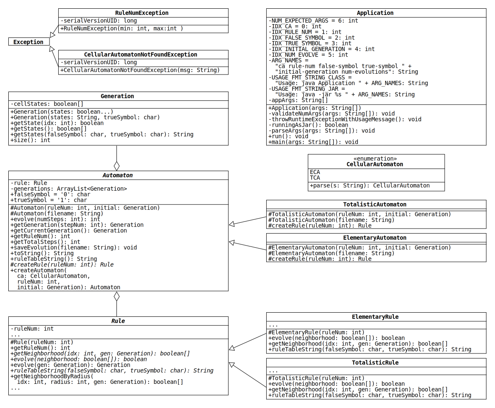

# Elementary Cellular Automata

> The key to maximizing reuse lies in anticipating new requirements and changes to existing requirements...
> To design a system so that it's robust to such changes, you must consider how the system might need to change over its lifetime.
> A design that doesn't take change into account risks major redesign in the future.
>
> &mdash;Gang of Four, in [*Design Patterns: Elements of Reusable Object-Oriented Software*](https://en.wikipedia.org/wiki/Design_Patterns)

## Introduction

This is a class project written in Java to to simulate the evolution of [elementary cellular automata](https://en.wikipedia.org/wiki/Elementary_cellular_automaton).
The goal of this project is to simulate a second type of one-dimensional, two-state cellular automaton while writing a minimal amount of new code and avoiding duplicate code.

## Overview

A UML diagram of the classes is shown below.
To view a larger version, open the file [uml.pdf](./uml.pdf) in a PDF reader.



## ElementaryRule

ElementaryRule represents any one of the 256 rules that govern the evolution of elementary CAs.

The methods `getNeighborhood(int idx, Generation gen)` and 
`evolve(boolean[] neighborhood)` will perform identically to the Rule class
defined in Project 1. Using the helper method  
`getNeighborhoodByRadius(int idx, int radius, Generation gen)`, you can implement
the `getNeighborhood(int idx, Generation gen)` method in one line of code.

This class has one additional method:

* `ruleTableString(char falseSymbol, char trueSymbol)`: Return a two-line representation of the elementary rule table.
The first line shows the 8 possible neighborhoods separated by spaces; the second shows the states of the center cells in the next generation.
Align each state character on the second line with the center of the corresponding neighborhood.
For example, below is the output of the method for rule 22 when given the arguments `'0'` and `'1'`:

  ```java
  "111 110 101 100 011 010 001 000" + System.lineSeparator() +
  " 0   0   0   1   0   1   1   0 "
  ```
  
  Here is the output for the same rule when given the arguments 
  `'F'` and `'T`':
  
  ```java
  "TTT TTF TFT TFF FTT FTF FFT FFF" + System.lineSeparator() +
  " F   F   F   T   F   T   T   F "
  ```

## TotalisticRule

TotalisticRule represents any one of the 64 rules that govern the evolution of 1D, two-state [totalistic CAs](https://mathworld.wolfram.com/TotalisticCellularAutomaton.html) with a neighborhood radius of 2.

Like elementary rules, totalistic rules determine the next state of a cell by looking at its current state and the states of its neighbors.
Unlike elementary rules, totalistic rules do not care about the arrangement of states in the neighborhood, only the *total* number of true states.
Totalistic rules map each total to the state of the center cell in the next generation.

To make these rules a bit more interesting, we will use a neighborhood radius of 2.<sup id="a2">[2](#f2)</sup>
This means that the neighborhood of a cell consists of five cells: the two nearest neighbors on the left, the cell itself, and the two nearest neighbors on the right.
Since the states of these cells can each be true or false, the total number of true states (i.e., the neighborhood total) is an integer between 0 and 5.

Totalistic rules can be depicted graphically with tables that are similar to those for elementary rules.
For example, here is the table for totalistic rule 22:
|  5  |  4  |  3  |  2  |  1  |  0  |
|:---:|:---:|:---:|:---:|:---:|:---:|
|false|true |false|true |true |false|

The top row shows the possible neighborhood totals in descending order.
The bottom row shows the states of cells with the corresponding neighborhood totals in the next generation.
For instance, if a cell has a neighborhood with 3 true states, totalistic rule 22 says that the cell's next state is false.

Totalistic rules are numbered analogously to elementary rules: replace false and true with 0 and 1 in the bottom row of the table and interpret the result as a binary number.
For the table above, the binary number is 010110, which is equal to 22 in base 10 (0 + 16 + 0 + 4 + 2 + 0).

Below are descriptions of the methods that TotalisticRule overrides in Rule:

* `getNeighborhood(int idx, Generation gen)`: This method works just like its ElementaryRule counterpart, but it returns a boolean array with five (rather than three) elements using this format:

  ```java
  [cellStates[idx-2], cellStates[idx-1], cellStates[idx], cellStates[idx+1], cellStates[idx+2]]
  ```

  If the index corresponds to the first or last two cells, use circular 
  boundary conditions to get the states of the neighbors. Using the helper
  method `getNeighborhoodByRadius(int idx, int radius, Generation gen)`, you can
  implement the `getNeighborhood(int idx, Generation gen)` method in one line 
  of code.

* `evolve(boolean[] neighborhood)`: Return the next state of a cell in a neighborhood with the given states by applying the totalistic rule.

* `ruleTableString(char falseSymbol, char trueSymbol)`: Return a two-line representation of the totalistic rule table.
Below is the output for rule 22 when given the arguments `'0'` and `'1'`:
  
  ```java
  "5 4 3 2 1 0" + System.lineSeparator() +
  "0 1 0 1 1 0"
  ```

## Automaton

The abstract Automaton class represents any 1D, two-state CA that evolves according to a rule represented by the Rule class.
Automaton behaves just like it did in Project 1, but it has three extra methods:

* `createRule(int ruleNum)`: Each subclass of Automaton overrides this abstract method so that it creates and returns an object of a particular Rule subclass.
Use the method to initialize the rule field in each constructor, rather than using the `new` keyword.

* `ruleTableString()`: Return a string representation of the table that depicts the rule governing the automaton.
Use the characters assigned to the fields `falseSymbol` and `trueSymbol` to represent the cell states.

* `createAutomaton(CellularAutomaton ca, int ruleNum, Generation initial)`: Return 
an instance of the appropriate Automaton child given a CellularAutomaton
value (ECA or TCA). This static method should return null if `ca` is null.

## ElementaryAutomaton & TotalisticAutomaton

ElementaryAutomaton and TotalisticAutomaton represent any 1D, two-state CAs that evolve according to the rules represented by ElementaryRule and TotalisticAutomaton, respectively.
Each subclass overrides createRule(int) so that it instantiates and returns an object of the corresponding Rule subclass with the given rule number.
The ElementaryAutomaton and TotalisticAutomaton constructors simply pass their arguments to the parent constructor with the matching parameter list.

## CellularAutomaton & CellularAutomatonNotFoundException

CellularAutomaton is an enum representing a type of cellular 
automaton. It includes a `parse(String s)` method that converts
a given string to a CellularAutomaton value. The parse method
throws an exception if the given string is not recognized.

CellularAutomatonNotFoundException is an exception thrown when
no appropriate CellularAutomaton exists. It gives error messages
in the form

```java
Unknown cellular automaton type XYZ
```

where XYZ is the actual string that was not recognized.

The code for both of these classes is complete and provided for you.

## Application

The Application class includes a main method accepting command line 
arguments to create and simulate an appropriate CA.

The Application accepts six command line arguments:

```console
ca rule-num false-symbol true-symbol initial-generation num-evolutions
```

1. `ca`: The type of cellular automaton, ECA or TCA.
2. `rule-num`: An integer value representing a rule number.
3. `false-symbol`: A character representing the false symbol.
4. `true-symbol`: A character representing the true symbol.
5. `initial-generation`: A string representation of the initial generation.
6. `num-evolutions`: Number of generations to evolve by.

For instance,

```console
$ java Application tca 22 0 1 0001000 3
0001000
0111110
0010100
1111111
```
## Running the Application 
To run the Application class in Eclipse, you will need to set the
command line arguments in the Run Configuration.

1. In the Package Explorer, find and right-click on `Application.java`
2. Go to **Run As > Run Configurations...**
3. Click on the **Arguments** tab
4. In the **Program arguments** box, type in the arguments you want to test (e.g., `tca 22 0 1 0001000 3`)
5. Click **Run**

After running, you should see the Console displaying an output. If you
pass in incorrect values, you should see the appropriate error messages.

To test different arguments, simply modify the values given in 
**Program Arguments**. You can quickly re-test an existing 
Run Configuration by clicking on the down arrow next to the normal
green Run button and selecting the Application configuration you defined.
